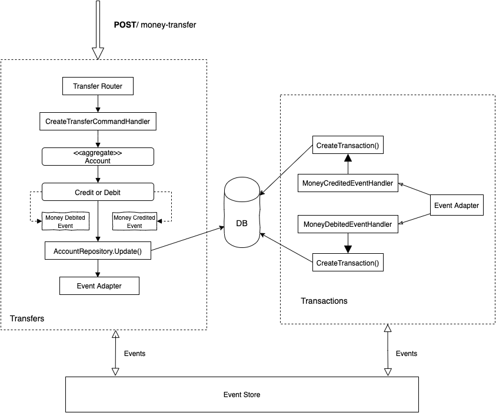

# Transactions

The basic idea is bank funds transfer from account A to account B that, if debiting from account A fails then the credit to account B should either never take place or be rolled back. From the user's perspective in actual bank transfers, first of all, the transaction must be created and then should be executed for processing, in our case considering as transfer happens between accounts in the same bank and same currency, hence validation should be pre-transaction record and result should be instant

### Example

Sample money transfer scenario. It could be implemented like this:

```kotlin
mutex.lock {
  val accountA = accounts.findByName("A")
  val accountB = accounts.findByName("B")

  accountA.debit(transferAmount)
  accountA.save()

  accountB.credit(transferAmount)
  accountB.save()
  
  transfers.save(Transfer(accountA, accountB))
}
```
## Basics

The money transfer functionality handled by `CreateTransferCommandHandler` this class more critical part of the application because it should be executed on safe concurrency. The class contains a method named `handle`, when the method called and `CreateTransferCommand` instance passed, and it executes synchronized block provided by Kotlin which works for `java threads` too, it means the same account cannot start transfer simultaneously from the different threads.

## DDD based architectural overview



In the diagram above the entry point is `Transfer Router` that handles HTTP Post request. The second step would be `CreateTransferCommandHandler` that changes `Account Aggregate` e.g subtracts and adds money for the current balance according to input parameters, during the action it also creates Domain Events such as `Money Debited` and `Money Credited` for each account to be able to trigger side effects across multiple aggregates in our case it triggers `Transaction Aggregate` using Event Store. Event Store and Command Handler implemented as an in-memory mediator based on an IoC container.

### Languages & Frameworks
- [kotlin](https://github.com/JetBrains/kotlin)
- [ktor web framework](https://github.com/ktorio/ktor)
- [koin dependency injection](https://github.com/InsertKoinIO/koin)
- [detekt static analysis]()

### Prerequisites
- JVM 8 or higher versions
- Gradle 5.6.2

### How to run
To be able build standalone app run following command
```
./gradlew build
```

For running executable file simple run builded file
```
java -jar ./build/libs/money-transfer-0.0.1-all.jar 
```

### Endpoints

**Get all accounts**
```shell script
curl --request GET \
  --url http://localhost:8080/api/v1/accounts/all
```

**Creating money transfer between two accounts**

```shell script
curl --request POST \
  --url http://localhost:8080/api/v1/transfer \
  --header 'content-type: application/json' \
  --data '{
	"sourceAccountId" : "591f6eb1-de7e-4d25-8afa-bd82d85ee565",
	"targetAccountId" : "8657792e-8329-4723-bf04-837d3649e9af",
	"amount": 10.2,
	"currency": "EUR",
	"reference": "Some message"
  }
```

**Getting account transactions**

```shell script
curl --request GET \
  --url http://localhost:8080/api/v1/transactions/account/8657792e-8329-4723-bf04-837d3649e9af
```

**Get account balance**
```shell script
curl --request GET \
  --url http://localhost:8080/api/v1/accounts/591f6eb1-de7e-4d25-8afa-bd82d85ee565/balance
```

## References
[Safe Concurrency](https://www.microsoft.com/en-us/research/wp-content/uploads/2005/01/SafeConcurrencySEFM2005.pdf)

[Domain Events](https://docs.microsoft.com/en-us/dotnet/architecture/microservices/microservice-ddd-cqrs-patterns/domain-events-design-implementation)

[Domain Aggregates](https://dddcommunity.org/wp-content/uploads/files/pdf_articles/Vernon_2011_2.pdf)

